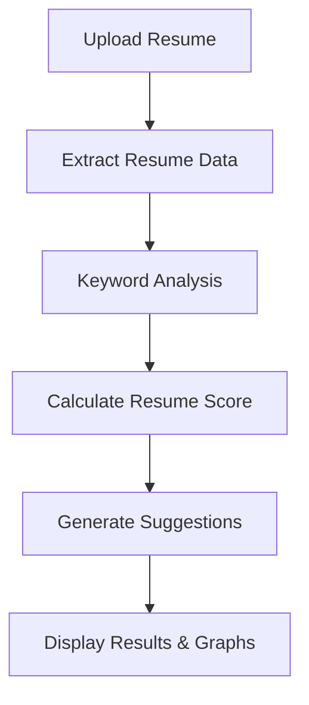

# 🚀 Resume Score Analyzer

<div align="center">


### 📄 Smart Resume Analysis & Scoring Web Application

Analyze resumes intelligently, calculate resume scores, and get improvement suggestions instantly.

<br>

<a href="https://web-production-1532f.up.railway.app/" target="_blank">
  
</a>

</div>

---

# 📌 About The Project

**Resume Score Analyzer** is a smart web application developed using **Python** and **Flask** that helps students and job seekers evaluate their resumes.

The system analyzes important resume sections like:

✔ Skills  
✔ Education  
✔ Experience  
✔ Keywords  

and generates:

✅ Resume Score  
✅ Improvement Suggestions  
✅ Graphical Analysis  

This project helps users create stronger resumes for better job opportunities.

---

# ✨ Features

🔹 Upload Resume Files  
🔹 Keyword-Based Resume Analysis  
🔹 Resume Scoring System  
🔹 Skill Detection  
🔹 Suggestions for Resume Improvement  
🔹 Graph Visualization using Matplotlib  
🔹 User-Friendly Interface  
🔹 Fast & Simple Processing  

---

# 🛠 Tech Stack

| Technology | Usage |
|------------|-------|
| Python | Backend Development |
| Flask | Web Framework |
| Pandas | Data Processing |
| NumPy | Score Calculation |
| Matplotlib | Data Visualization |
| OOP | Structured Programming |
| File Handling | Resume Reading & Processing |

---

# ⚙️ Working Process



---

# 📂 Project Modules

### 🔹 User Interface Module
Built using Flask for interaction with users.

### 🔹 File Processing Module
Reads and processes uploaded resumes.

### 🔹 Data Analysis Module
Uses Pandas and NumPy for analysis and scoring.

### 🔹 Visualization Module
Generates graphs using Matplotlib.

### 🔹 Suggestion Module
Provides resume improvement recommendations.

---

# 🎯 Objectives

- Analyze resume content effectively
- Generate accurate resume scores
- Provide useful improvement suggestions
- Visualize analysis using graphs
- Build a responsive and user-friendly system

---

# 🔮 Future Enhancements

🚀 AI-Based Resume Analysis  
🚀 ATS Compatibility Checker  
🚀 Job Recommendation System  
🚀 Online Deployment  
🚀 Advanced NLP-Based Keyword Matching  

---

# ⚠️ Limitations

- Basic keyword matching technique
- No advanced AI integration
- Limited predefined dataset

---

# 💻 Installation Guide

## Clone Repository

```bash
git clone https://github.com/your-username/resume-score-analyzer.git
```

## Move to Project Folder

```bash
cd resume-score-analyzer
```

## Install Dependencies

```bash
pip install -r requirements.txt
```

## Run Flask Server

```bash
python app.py
```

---

# 🌐 Live Project

<div align="center">

## 👉 [CLICK HERE TO VIEW LIVE PROJECT](YOUR_LIVE_LINK_HERE)

</div>

---

# 🤝 Contributors

<div align="center">

| Name | Role |
|------|------|
| **Shivam Maurya** | Developer |
| **Kavya Kushwaha** | Developer |

</div>

---

# 📜 License

This project is made for educational purposes only.

---

<div align="center">

### ⭐ Don't forget to Star this Repository ⭐

</div>
````
